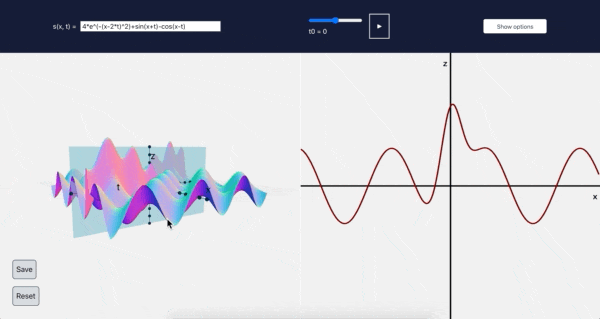

# Vibrating string app

Graphs a function of two variables, s(x,t), and animates a fixed value
of the second variable, called t0. Graphs the function s(x,t0) next to
the 3d graph of s(x,t), so one can see how s(x,t0) changes as t0 changes.

https://www.maths.usyd.edu.au/u/jburke/vibrating_string/



## Implementation details

### Structure

The raw ingredients are [React](https://reactjs.org/), [ThreeJS](https://threejs.org/), and [jotai](https://github.com/pmndrs/jotai), with [Tailwind](https://tailwindcss.com/) for styling
and [Reakit](https://reakit.io/) for an accessible modal. 

The program is structured as follows:

The entire page and program is a single React component named App,
with the following structure, which is explained further below:
```javascript
function App() {
    return (
        <JotaiProvider>
			<header>
				<funcAtom.component/>
				<animationDataAtom.component/>
				<OptionsModal/>
			</header>
			<main>
				<ThreeSceneComp>
					<Axes3d/>
					<Grid/>
					<FunctionGraph3D/>
					<Plane/>
					<CameraControls/>
				</ThreeSceneComp>
				<CanvasComp>
					<Axes2D/>
					<FunctionGraph2D/>
				</CanvasComp>
				<DataComp/>
			</main>
        </JotaiProvider>
    );
}
```

Jotai is an 'atomic state' library. Its significance is explained
below.

Inside the header are the two input components and a button that
toggles a modal tabular component, with various options related to the
scene.

The html element returned by ThreeSceneComp is the canvas element that
ThreeJS draws into. The state of ThreeSceneComp is a single object,
called ThreeCBs. It's initialized with a call to
ThreeSceneFactory. This is a factory function that returns an object
with methods to manipulate a ThreeJS scene, camera, renderer,
etc. that are stored in the function closure. ThreeSceneComp passes
ThreeCBs to all of its children as a prop.

The children of ThreeSceneComp define what is shown in the ThreeJS
 scene in the browser. They are all abstract components (they return
 null).  They receive ThreeCBs as a prop, and use it to, e.g., add or
 remove meshes from the scene in effects depending on various state
 (meshes are things that can be seen by the viewer).
 
CanvasComp is analogous to ThreeSceneComp, except that its children
are drawn on a 2d canvas.
  
The component DataComp is described below.

### State Management

The state in the app is deeply nested, and in different parts of the
tree. For instance, initial point state is an
array of two numbers and is used by InitialPointInput in
the header, and IntegralCurve in ThreeSceneComp. So by convention,
this state should be lifted to the App component, and similarly for
the rest of the state.

This is not great for the speed of the app. For instance, when the
initial point is being dragged, ThreeSceneComp, and all of its
children, would be called many times per second. Creating and
destroying any of the objects involved in ThreeScene is a major
bottleneck. So if all of
the state were contained in App, one would have to be very vigilant in using
keys and not creating new
objects (and so losing reference equality of props). And even in this
case, if we add many more components to the tree, it will slow down.

Using Jotai for state management avoids this problem. It works by setting up a second
state tree,  independent of the usual one ([this video](https://www.youtube.com/watch?v=_ISAA_Jt9kI&ab_channel=ReactEurope) by the
creator of Recoil, a very similar library and predecessor to jotai,
is the canonical explanation). The
objects that hold jotai state are called atoms, and React components can use
atoms to subscribe to jotai state. Atoms are stable under
rerenders. 

All of the atoms used by the program are created in atoms.ts, and
exported to App, which doles them out to components as needed. 

DataComp is created in the atom.ts file, and has access to all of the
atoms in the app. DataComp returns as html element a div with two
buttons, Save and Reset. The Save button writes the current state of
all the atoms (all the global state of the app) into the query string
of address, and reset sets all atoms to their defaults. DataComp is also
responsible for changing atom values when the page is loaded with a
query string.
